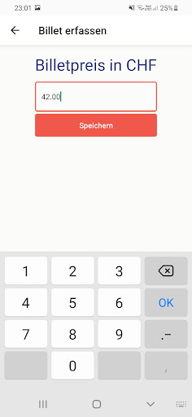
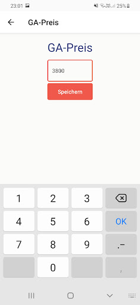
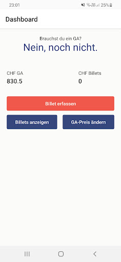

  <h1>Brauch ich ein GA?</h1>
  
  
Find out when it makes sense to switch to a Generalabonnement (GA)!

# Screenshots

  
  
  

# Vision

A mobile application that requires no user registration and login that lets you track all public transit expenses.
As soon as the expenses exceed the user defined price of a Generalabonnement (GA), the user is notified.

# Google Play Store

This App is available on the [Google Play Store](https://play.google.com/store/apps/details?id=ch.pricemeier.brauchicheinga).
